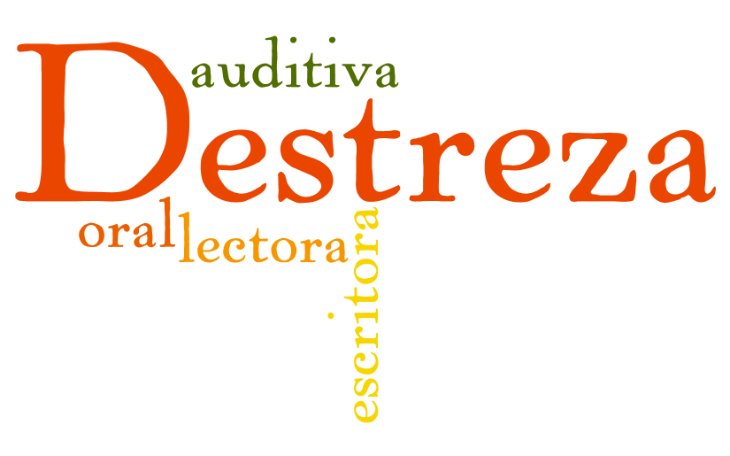

# Atención a las distintas destrezas

Como hemos referido en el apartado de identificación de la lengua, una de los aspectos que hay que considerar a la hora de determinar la lengua propia de un tema que se va a trabajar en la L2 serán las destrezas lingüísticas que se ponen en juego en la clase AICLE: **escuchar, leer, escribir y hablar.**

Bien es cierto que hay que diferenciar la cantidad de _input_ que de cada una se invierte en edades más tempranas, siendo la comprensión y expresión oral la destreza a la que mayor énfasis se da en educación infantil y los primeros años de educación primaria.

Determinados contenidos se prestan más a practicar determinadas destrezas. Por otro lado, es obvio que las** destrezas receptivas** son más fáciles de practicar. No obstante para que la lengua se fije y aprenda** es preciso desarrollar destrezas productivas,** escribir y hablar. Y por tanto hay que procurar cualquier oportunidad que se tenga de **introducir de manera equilibrada todas las destrezas** comunicativas. El concepto de andamiaje es aquí importante, ya que en muchos casos será preciso apoyar la práctica de las destrezas con un andamiaje adecuado, sobre todo en las productivas. Parte de ese **andamiaje** puede consistir en el caso de la** lectura o escucha** en: organizadores como mapas conceptuales, líneas del tiempo, textos para completar, pistas, imágenes, errores, etc.

Además se pueden plantear** actividades lectoras o auditivas** de muy diversas maneras en grupo e incluso por parejas. Una buena práctica es optar por las galerías online gratuitas de las editoriales o usar audiolibros, como por ejemplo en la página [esl-bits.net](http://esl-bits.net/ESL.English.Learning.Audiobooks/ESL.English.Learning.Audiobooks.html) donde se puede leer y escuchar a dos velocidades multitud de libros, desde [Diary of a Wimpy Kid](http://esl-bits.net/ESL.English.Learning.Audiobooks/Wimpy.Kid/preview.html) to [1984](http://esl-bits.net/ESL.English.Learning.Audiobooks/1984/preview.html) (secundaria y bachillerato)

En cuanto a la** destreza oral,** hay que facilitar modelos de estructuras funcionales y discursivas. Ese** uso de "modelos de estructuras" y frases tipo** que el alumno puede emplear sabiendo que son adecuadas es clave. Algo fundamental también es dar tiempo para que el alumno tome la palabra y se sienta con confianza para hablar y cometer errores. Además de las intervenciones cortas en directo, se pueden hacer exposiciones orales más amplias y guiadas. La creación y grabación de _podcasts_ y vídeos es otra de las actividades que promueve la destreza oral. [En este enlace](https://docs.google.com/document/d/1xadX0DBdH1IXgf0oGb4gFLg4dmBQrLrynLbffwYc1sc/edit) puedes ver más consejos y actividades para la práctica oral (en inglés).

Por último, la destreza escritora debería ser guiada en la medida que se necesite. Al principio es importante ofrecer cierto andamiaje, frases, vocabulario e indicaciones para hacer una escritura más o menos guiada. Un ejemplo sería la reconstrucción de textos. El producto final objeto de la escritura puede ser también distinto de un texto al uso. Así puede ser un póster o una presentación. Y como no, una variedad más colaborativa se consigue al trabajar en parejas o en grupos.

Guardar