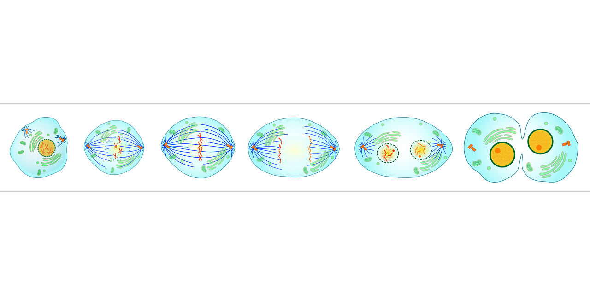

# Ejemplo 1. Órganos del cuerpo y de la célula

En este caso el tema es el de la célula y el nivel, el de **1º ESO**:

Partimos de una presentación sobre el cuerpo y sus órganos:[Inside my body](http://formacion.educalab.es/pluginfile.php/52911/mod_imscp/content/5/Inside_my_body.ppt).Para facilitar la comprensión tanto de la presentación como del vídeo se prepara un[glosario](video_ppt_thecell.pdf). Nótese que se ha incluido la fonética que ayuda a la pronunciación de las palabras, en ocasiones semejantes a las españolas pero de pronunciación diferente.

A posteriori se realizan[ejercicios](voc_exercises_thecell.pdf)que refuerzan tanto el vocabulario como el contenido de área.

Por último se hace un[ejercicio online](http://www.proprofs.com/quiz-school/story.php?title=parts--cell)sobre las partes de la célula. Otra opción sería realizar un [kahoot ](https://getkahoot.com/?utm_name=controller_app&utm_source=web_app&utm_medium=link)si se dispone de la tecnología necesaria en el aula. Un ejemplo en esta actividad sobre [la célula](https://play.kahoot.it/#/k/1bba31bb-7958-48b3-be08-0c93f2805ecb/intro).

**La tarea final**consiste en preparar y escenificar un diálogo entre los alumnos y uno o dos supuestos  científicos que contestan a las preguntas sobre los órganos del cuerpo y las células que plantean el resto de alumnos de la clase.

En este caso los recursos del vídeo y la presentación nos sirven de excusa para elaborar otros materiales que ayudan al aprendizaje del vocabulario y el contenido sobre las partes de la célula.