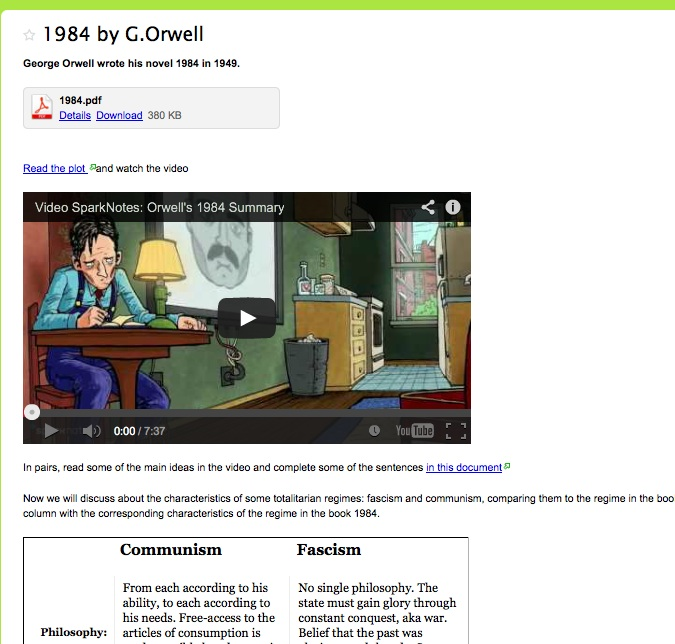

# Ejemplo 2. Totalitarismo

Este segundo ejemplo trata el tema del**totalitarismo**y el libro de George Orwell,**1984**, tema que se puede tratar en 4º ESO y en 1º de Bachillerato.

*   Partimos de un[vídeo](http://www.youtube.com/watch?v=h9JIKngJnCU)que hace un resumen del libro desde el punto de vista del totalitarismo y sus prácticas.

*   Antes de ver el vídeo y para que éste sea más comprensible la auxiliar lingüística hace una[presentación](1984.pdf)en la que se conecta el argumento del libro con los regímenes totalitarios y que también da información sobre el autor y su momento, al igual que se explica algún vocabulario.
*   A continuación se ha preparado[un texto resumen](https://docs.google.com/document/d/1pMEX7wEByoQEvs5xfTaz0k4jYszc1dhxoXfRqFmpWC4/edit)del libro que se va a leer comentando el vocabulario previamente al visionado del vídeo. Esta actividad se lleva a cabo por secuencias, es decir se leerán varios párrafos y se verá la parte correspondiente del vídeo, continuando con la segunda parte del texto y del vídeo.
*   Tras ver el vídeo los alumnos[completarán](https://docs.google.com/document/d/19AVfuFZgs1jCYxnW4ipU5YC7GoEgjiUCqPAj6BiUd6k/edit)alguna información de la escuchada en el mismo, partiendo de frases comenzadas pero no terminadas (andamiaje), relacionada sobre todo con lo que se puede o no hacer en un régimen totalitario como el del libro 1984.
*   La tarea final consiste en analizar dos tipos de regímenes totalitarios como son el fascismo y el comunismo en conexión con el argumento del libro. Como parte de andamiaje para dicho análisis y discusión usarán una tabla con las características de dichos regímenes y deberán completar algunos de los aspectos en otra columna para las características del régimen del libro.
*   Como herramientas, se han utilizado[una wiki](http://otura4a2013.wikispaces.com/1984+by+G.Orwell)para insertar el vídeo, la presentación y la tabla, así como enlazar los documentos con el resumen y las frases que deben completar los alumnos, ambos creados y enlazados desde**Google Drive**. En el siguiente apartado hablaremos de estas herramientas.

En este caso se ha usado el recurso del vídeo tal cual y se ha preparado**un texto**procedente de**distintas fuentes simplificando**y**adaptándolo**a la competencia lingüística de los alumnos, pero siempre un punto por encima para que ofrezca el reto de cierta dificultad. Hemos integrado los recursos del vídeo y la tabla encontrados y hemos elaborado una presentación y un documento de texto simplificado a partir de recursos encontrados en la red. El resultado es la práctica de las 4 destrezas y la atención al contenido y a la lengua.

Si quisiéramos transformar el vídeo, podríamos usar [Edpuzzle](https://edpuzzle.com/)para añadir preguntas sobre el mismo. También podemos usar[Playposit](https://www.playposit.com/)para explicar o repasar el tema.

