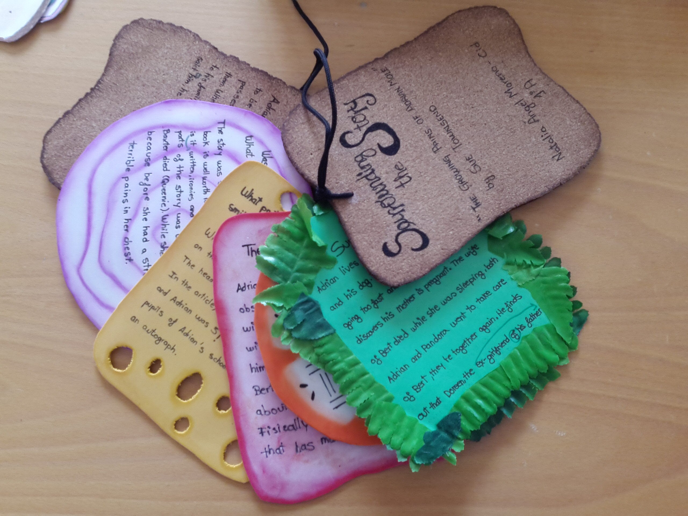

# Organizadores de ideas

**Para crear organizadores de ideas, _brainstorming_, nubes de palabras, mapas conceptuales**, útiles para:

*   Realización de lluvia de ideas, introducción de conceptos, contenidos.
*   Resúmenes de contenidos, conclusiones principales de ideas.
*   Ampliación de vocabulario agrupado por campos semánticos.
*   Realización de descripciones.
*   Explicación de temas, realización de esquemas.
*   Crear líneas temporales
*   Crear textos argumentativos y debatir a partir de los mismos.

 Herramientas:

*   [Graphic organizers](http://www.worksheetworks.com/miscellanea/graphic-organizers.html): organizadores gráficos para repasar vocabulario, hacer resúmenes, preparar una presentación
*   [Mind42](http://mind42.com/), [Bubbl.us](https://bubbl.us/), [Mindmeister](http://www.mindmeister.com/es), [Mindomo](http://www.mindomo.com/es/): creación de mapas mentales.
*   [Padlet](http://padlet.com/): lienzo digital en blanco para expresar lo que quieras: conceptos, contenidos...
*   [Tagxedo](http://www.tagxedo.com/): nubes de palabras que adquieren formas preinstaladas.
*   [Wordle](http://www.wordle.net/): sencillo editor de nubes de palabras en línea, que después pueden enlazarse o embeberse en espacios web tipo blogs, wikis, etc. Para visualizar las nubes de palabras es necesario tener Java instalado en el equipo o ejecutarlo al ver una nube.

*   [Sutori](https://www.sutori.com/): crea líneas de tiempo interactivas que pueden embeberse en otros espacios web. Un ejemplo [The French Revolution](https://www.sutori.com/story/the-french-revolution-eb10)

**Experiencias:**

*   [The Popplet Experience](http://recursostic.educacion.es/blogs/malted/index.php/2013/02/08/the-popplet-experience): experiencia de aula con alumnado de inglés de 1º ESO en la que para presentar diversos lugares de Asturias a un grupo de estudiantes británicos, como parte de un proyecto Comenius.
*   [The Value of Wrinkles - Apreciando Arrugas](http://www.pinterest.com/mjgsm/the-value-of-wrinkles-apreciando-arrugas/): tablero colaborativo sobre el proyecto bilingüe Arrugas/Wrinkles, un proyecto educativo audiovisual sobre trabajo didáctico con el corto Arrugas, para rendir un homenaje a los abuelos y establecer diálogo intergeneracional.

Guardar

Guardar