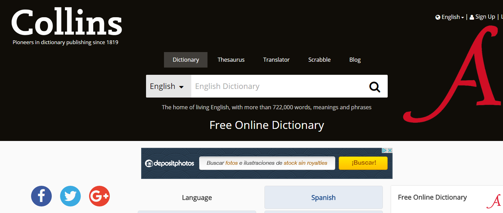

# Recursos lingüísticos específicos de L2

En este apartado vamos a tratar de  aquellos **recursos **y **materiales específicos para el aprendizaje de la lengua**, que en muchos casos se pueden utilizar en la clase AICLE para apoyar el aprendizaje de lengua y contenido. No obstante, es importante recordar el trabajo cooperativo entre el profesorado de la L2 y el profesorado AICLE.

Fundamentalmente, destacamos los diccionarios, glosarios, aplicaciones(o páginas web) para mejorar la pronunciación o la gramática. En el caso de los más jóvenes, cuanto más lúdicos sean estos recursos, mucho mayor será su avance. Asimismo, el mundo de las nuevas tecnologías ha abierto las puertas a una nueva manera de aprender, abriendo las puertas del aula y así logrando que la motivación del alumno y el deseo de aprender no termine en las puertas del colegio. Es muy interesante visitar las páginas institucionales de los diferentes Institutos lingüísticos ([Cervantes](http://www.cervantes.es/default.htm), [Institute Français](http://www.institutfrancais.es/madrid/), [Goethe Institut](https://www.goethe.de/ins/es/es/index.html), [Istituto Italiano di Cultura](http://www.iicmadrid.esteri.it/iic_madrid/es/), [British Council](https://www.britishcouncil.es/)) ya que ofertan servicios y actividades que pueden ser muy útiles para el aula AICLE.

  

En primer lugar vamos a destacar los **diccionarios**, sobre todo los que ofrecen imágenes y pronunciación. Así, por ejemplo, encontramos distintos tipos de diccionnarios:

*   diccionarios tradicionales muy completos: [Macmillan Dictionary](http://www.macmillandictionary.com/), [Oxford Dictionary](https://en.oxforddictionaries.com/), [Cambridge Thesaurus](http://dictionary.cambridge.org/es/index.html), [Wordreference.com,](http://www.wordreference.com/)
*   diccionarios interactivos, que transforman una página en un corpus con opción a traducir cada una de las palabras en el mismo contexto de la página: [Lingro.com](http://lingro.com/),
*   diccionarios visuales: [Merriam Webster visual dictionary](http://visual.merriam-webster.com/index.php), [Shahi visual dictionary,](http://blachan.com/shahi/) [Lo que veo](http://www.leoloqueveo.org/), [Language guide](http://www.languageguide.org/english/) (en muchas lenguas)
*   sólo de pronunciación: [Howjsay](http://www.howjsay.com/)

Este tipo de recursos pueden darse a conocer al alumnado para que hagan uso de ellos cuando los necesiten, de una manera autónoma. A continuación destacamos algunos enlaces útiles.

Los **glosarios** específicos de materias serán también una herramienta muy útil para apoyar el aula AICLE, algunos ejemplos en inglés [Audioglosario de Geografía de 1º ESO,](http://www.students.linguaframe.com/gh1-audio-glossary) [Diccionario de matemáticas](http://www.amathsdictionaryforkids.com/dictionary.html). Un enlace interesante es el glosario para [profesores CLIL](http://www.cambridgeenglish.org/images/22194-tkt-clil-glossary-document.pdf) de la Universidad de Cambridge. Más enlaces de este tipo pueden consultarse en [esta página](http://isabelperez.com/tesllinks2.htm).

**Otros recursos específicos de lengua** que pueden ser útiles son aquellos que van a permitir a los alumnos mejorar la pronunciación y los aspectos gramaticales de la lengua. Este tipo de recursos pueden ser proporcionados para que el alumno pueda practicar y mejorar en el aula de L2 y fuera de ella. Un ejemplo son las actividades desarrolladas con [MALTED](http://recursostic.educacion.es/malted/web/) o los mismos ejercicios de la plataforma [AGREGA](http://agrega.educacion.es/visualizadorcontenidos2/Portada/Portada.do;jsessionid=10A682EE35AD8F0D7BCF36BDDFEB4D85). Encontrarás muchos enlaces de interés para estos dos aspectos en los siguientes enlaces:

**Inglés**:

*   Para practicar gramática: [Englishmedialabs ](http://www.englishmedialab.com/elementaryquizzes.html), [English Grammar Games](http://www.eslgamesworld.com/members/games/grammar/) o [Sentence Monkey](http://www.eslgamesplus.com/sentence-monkey/). Para niveles superiores:  [Grammarflip](https://www.grammarflip.com/)
*   Para practicar pronunciación: [English4kids](http://www.english-4kids.com/phonicsheets.html), [English Media Lab](http://www.englishmedialab.com/pronunciation.html)
*   Para practicar fonética: [Cambridge English Online](http://cambridgeenglishonline.com/Phonetics_Focus/) (abrir en Internet explorer)

**Francés**

*   [Grammaire et Vocabulaire](http://isabelperez.com/french1.htm#gram)

**Español**

*   [Gramática](http://www.todoele.net/ejgram/Ejercicios_list.asp),[Otros materiales](http://www.todoele.net/materiales0.html)
*   [Materiales para la clase de ELE Nivel A1](https://www.mecd.gob.es/francia/dms/consejerias-exteriores/francia/publicaciones/material-didactico/Materiales-ELE/2010/materialesELE2010A1.pdf)/[Materiales para la clase de ELE Nivel A2](http://www.mecd.gob.es/dms-static/f73295a2-718d-46b0-87da-92d4e4fde00e/consejerias-exteriores/francia/publicaciones/material-didactico/materialesele2011a2.pdf)

Además de las aquí mencionadas, existen muchas [apps](https://es.pinterest.com/pin/226517056234339424/) para usar en los dispositivos móviles que el docente y los padres pueden usar para incentivar el aprendizaje de la L2.Guardar

Guardar

Guardar